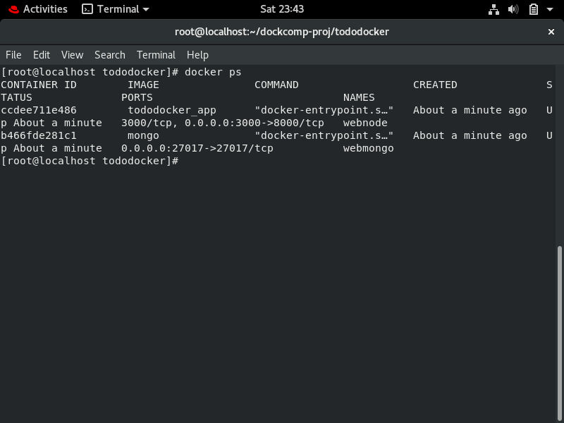

# TodoApp with Docker

## App 1/2 created using Docker

I have created __two apps__ for submission.
The other one can be found in [this link](https://github.com/aditya-mitra/yelpcamp-docker)

### What I created?

I have created a simple Todo App using NodeJS and Mongo which is running on a docker container.
There is a one-click setup which can be seen below.

I had learnt web development from a bootcamp so I thought of creating this app.

The Todo App here is the one which I have created from scratch.

## Quick Setup

*Assuming you have [docker](https://docs.docker.com/get-docker/) installed in your system, type this in the cloned repo:*

```
docker-compose up
```


**The container will start building up and will be ready in few moments**

You may see it like this:


**Head over to [localhost:3000](http://localhost:3000) to see use the app running inside docker container**


If you run `docker ps`, you will see the below image:

**You can see two container _web node_ and _web mongo_ have fired up**



**Also one image has also been created in the *docker images***

Run `docker images` to see it :


## Software used

**I used**

- My OS -> RHEL8
- Code Editor -> Visual Studio Code
- Docker
- NodeJS


# Acknowledgments


I want to thank [Mr Vimal Daga](https://www.linkedin.com/in/vimaldaga/) without whom this project would not have been complete
I learnt to use RHEL8 and Docker from his free sessions which conducted on youtube.


I also want to thank the most helpful team at [linux world](http://www.linuxworldindia.org/).
They were just amazing at their communication and for giving us enought time to complete this wonderful project!